<h1 align="center">
  <br>
  <a href="/">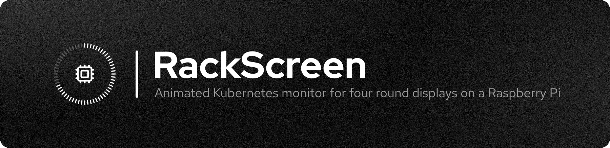</a>
  <br>
</h1>

<p align="center">
  <a href="https://github.com/silkepilon/RackScreen/releases/latest"></a>
  <a href="LICENSE"></a>
  <a href="https://github.com/silkepilon/RackScreen/actions/workflows/ci.yml"></a>
  
  
</p>

<p align="center">
  <a href="#install">Install</a> &nbsp;·&nbsp;
  <a href="#screens">Screens</a> &nbsp;·&nbsp;
  <a href="#setup-tui">Setup TUI</a> &nbsp;·&nbsp;
  <a href="#electricity-mode">Electricity mode</a> &nbsp;·&nbsp;
  <a href="#sky-roles">Sky roles</a> &nbsp;·&nbsp;
  <a href="#configuration">Configuration</a> &nbsp;·&nbsp;
  <a href="#development">Development</a>
</p>

---

RackScreen drives four GC9A01 240x240 round displays from a Raspberry Pi 3B+ and turns them into a live picture of your Kubernetes cluster and your grid. Each panel is one icon, one segmented ring and a small outlined badge on black, and none of it is ever static: values ease into place, the last segment breathes, icons run micro-loops. Cluster events splash on the screen that owns them, big events sweep the whole rack top to bottom, and a screen can cycle through several roles with an iris transition. Nine roles come from the cluster, four from [Electricity Maps](https://app.electricitymaps.com) and the day-ahead price feeds, seven from the sky over your house and one from GitHub, so the same rack can show pods on one panel and today's electricity price on the next.

## Screens

Every GIF below is the real renderer fed by the simulator, one panel, 20 fps.

|  |  |
|:--:|:--:|
| 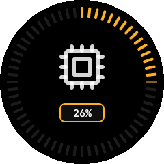 | 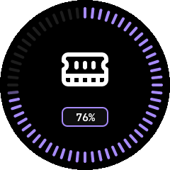 |
| **`cpu`** — cluster CPU load; a node over the threshold splashes a flame | **`mem`** — cluster memory use, the ring easing to every new sample |
| 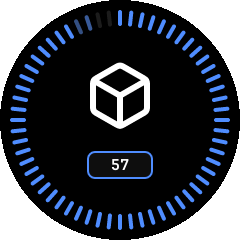 | 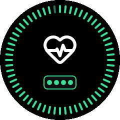 |
| **`pods`** — running pods; every start and crash splashes its own icon | **`health`** — one dot per node, green while the cluster is happy |
| 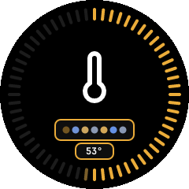 | 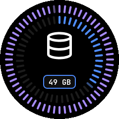 |
| **`thermal`** — the hottest node, blue to amber to red as it climbs | **`storage`** — volumes outside, used capacity inside; a sick volume breathes amber |
| 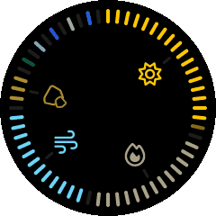 | 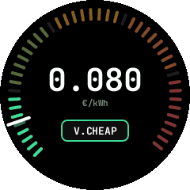 |
| **`power-mix`** — the grid production mix, one arc and icon per source | **`price`** — the day-ahead price per hour, the current hour breathing |
| 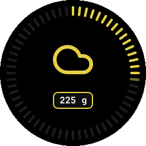 | 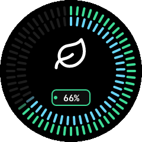 |
| **`carbon`** — grid carbon intensity, on the Electricity Maps colour scale | **`renewable`** — the renewable share outside, the fossil-free share inside |
| 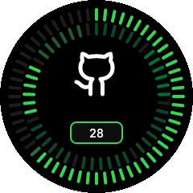 | 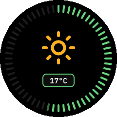 |
| **`gh-activity`** — today's contributions outside, the last week inside; pushes, stars and CI results splash | **`weather`** — the temperature ring and an icon for the sky; thunder splashes |
| 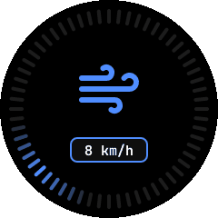 | 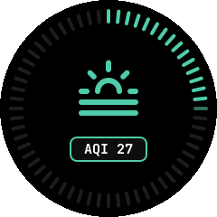 |
| **`wind`** — a compass arc where the wind comes from, gusts flick it wider | **`aqi`** — the European air quality index on its colour bands |
| 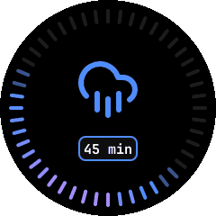 | 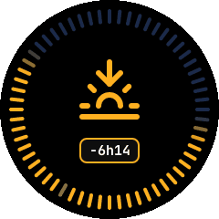 |
| **`rain`** — the next two hours in five-minute slots; rain within 15 min splashes an umbrella | **`sun`** — a 24-hour dial, daylight amber, counting down to sunset or sunrise |
| 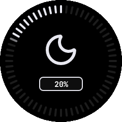 | 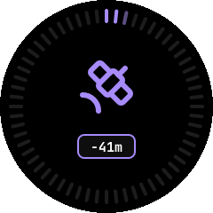 |
| **`moon`** — the illuminated fraction, lit the way the phase is going | **`iss`** — the ring empties toward the next ISS pass; a visible pass sweeps the rack |
| 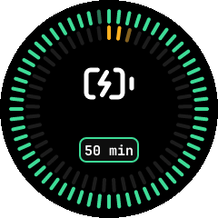 | 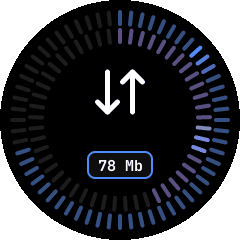 |
| **`ups`** — battery outside, load inside; mains loss sweeps the rack red | **`net`** — download outside, upload inside, crawling with the flow |
| 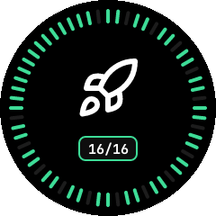 | |
| **`deploys`** — one arc per Argo CD application; a sync splashes the rocket | |

<p align="center">
  
</p>
<p align="center">
  <b>HEALTH doubles as a download monitor.</b> When every node is ready, nothing is firing and qBittorrent is pulling, the health ring is replaced by one ring per torrent; here a finished download sweeps the rack green and its ring unwinds.
</p>

<p align="center">
  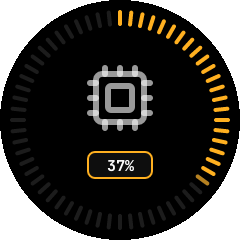
</p>
<p align="center">
  <b>One screen, every role.</b> A screen cycles through the roles you give it and irises between them: the old role zooms into the middle, the new one grows back out of it, ring first.
</p>

**How events look.** A pod starting, a pod crashing, a hot node, a degraded volume or a new torrent *splashes* on the screen that owns that role: a ripple runs out from the centre, the ring flashes the event colour in a wave, and the role icon swaps to the event icon with a little overshoot before easing back. A node going down or coming back, an alert firing or resolving, a finished torrent, a restored link and a fresh boot *sweep* the whole rack: the ring wipes to one colour on every panel in turn, top to bottom (bottom to top for bad news), holds an icon for a moment and wipes back.

## Install

One line on the Pi, no clone:

    curl -fsSL https://github.com/silkepilon/RackScreen/releases/latest/download/install.sh | bash

It downloads the latest `aarch64` release and opens the setup menu. **Install** copies the binary to `/usr/local/bin`, writes `/etc/rackscreen/config.yaml`, installs the `rackscreen@<user>` service and offers to enable SPI in the boot files. The service runs `rackscreen run --config /etc/rackscreen/config.yaml`; later runs of the menu are just `rackscreen` (it asks for sudo).

> [!NOTE]
> Enabling SPI edits the boot files, so reboot the Pi afterwards before the panels light up.

To upgrade, re-run the one-liner, or use **Update** in the TUI, or `sudo rackscreen update`. It downloads the latest release, verifies its SHA-256, swaps `/usr/local/bin/rackscreen` and restarts the service; `rackscreen update --check` only reports (exit 0 up to date, 1 update available, 2 unknown). Your config is left alone either way.

Config is YAML at `/etc/rackscreen/config.yaml`, with the defaults in [`config.example.yaml`](config.example.yaml). The kubeconfig defaults to `~/k8s-monitor.yaml` of the service user. Upgrading from v0.1: `~/.config/rackscreen/config.toml` is no longer read, so re-enter your settings via **Configure**.

## Setup TUI

`rackscreen setup` (what the installer opens) is a ratatui shell: a sidebar on the left with the eight actions, a pane on the right, and a help row at the bottom. `↑↓` move the sidebar bar, `⏎` opens, `Esc` returns to Home (`←` does the same on screens that do not use it themselves; Configure and Calibrate do). Below 72 columns the sidebar folds away and Home shows the menu itself.

- **Home** — a live overview: service state and uptime, boot enablement, a dot per link (`k8s`, `prometheus`, `qbittorrent`, `argocd`, `weather`, `rain`, `github`, `electricity`, `prices`), what each screen cycles through (long lists end in `+N`), and the last three log lines.
- **Install** — set up service + config: binary, `/etc/rackscreen/config.yaml`, the `rackscreen@<user>` unit, optional SPI in the boot files.
- **Calibrate** — fix rotation / mirroring. The selected panel is drawn large in the terminal from the very frame the glass shows (half-block pixels, needs a true-colour terminal; otherwise a drawn circle), the other panels are a strip underneath. Press `r`/`R`/`f` until the arrow points up and the dot is top-right, `a` copies to all, `s` writes `rotate` and `hflip`.
- **Screens** — what each screen shows and how fast it cycles; see [Screens and roles](#screens-and-roles).
- **Configure** — every setting in six groups (Cluster, Services, Energy, Sky, Display, Thresholds) picked with `←→` in the sidebar; each module has an on/off badge and the focused field shows a one-line explanation. `s` saves everything and offers a restart; `Esc` with unsaved changes asks first.
- **Status** — the full service detail, links, boot files and the log tail; `l` for the log view, `r` to restart.
- **Run here** — run the daemon in the foreground with its logs, without touching the service.
- **Update** — download the latest release, verify its SHA-256, swap the binary and restart the service.
- **Uninstall** — remove the binary, config and service; the boot file lines stay.

## Screens and roles

Every screen shows one or more **roles** and cycles through them. Twenty-one roles exist:

| Role | Data source | Ring and badge |
|---|---|---|
| `cpu` | Prometheus | ring is cluster CPU load, badge the percentage |
| `mem` | Prometheus | ring is memory use, badge the percentage |
| `pods` | Kubernetes API | ring is running pods against the total, badge the count |
| `health` | Kubernetes API + Prometheus | one dot per node, or one ring per torrent in download mode |
| `thermal` | Prometheus | ring is the hottest node, `hot node temp °C` marks the danger band |
| `storage` | Prometheus (Longhorn) | outer ring a section per volume by robustness, inner ring the used capacity |
| `power-mix` | Electricity Maps | one arc and icon per production source in your zone |
| `price` | EnergyZero or ENTSO-E | one pair of segments per hour of today, the current hour breathing |
| `carbon` | Electricity Maps | ring and colour follow gCO2eq/kWh |
| `renewable` | Electricity Maps | outer ring the renewable share, inner ring the fossil-free share, badge alternating |
| `gh-activity` | GitHub | today's contributions against the month's best outside, the last 7 days inside, badge today's count |
| `weather` | Open-Meteo | temperature ring, icon from the WMO weather code, badge °C |
| `wind` | Open-Meteo | compass arc where the wind comes from, badge km/h |
| `aqi` | Open-Meteo | European AQI ring on the EEA colour bands, badge the index |
| `rain` | Buienradar | the next two hours in 5-minute slots, badge minutes to rain |
| `sun` | computed | 24-hour dial with daylight, badge countdown to sunset or sunrise |
| `moon` | computed | illuminated fraction, badge percent alternating with the phase |
| `iss` | Celestrak + SGP4 | countdown to the next ISS pass, badge minutes |
| `ups` | Prometheus (nut-exporter) | battery charge outside, load inside, badge runtime |
| `net` | Prometheus (node-exporter) | download outside, upload inside, badge Mbit/s |
| `deploys` | Argo CD | one arc per application by sync and health, badge healthy over total |

**Screens** in the setup TUI edits them: `↑↓` pick a screen, `⏎` opens the role picker (`space` toggles a role, `K`/`J` reorder, `⏎` closes), `+`/`-` change the cycle interval in 5 s steps, `s` saves. Four presets fill all four screens at once: `c` cluster (`cpu`, `mem`, `pods`, `health`), `e` electricity (`power-mix`, `price`, `carbon`, `renewable`), `m` mixed (each screen alternates a cluster role with an electricity one) and `w` sky (`weather`+`aqi`, `rain`+`wind`, `sun`+`moon`, `iss`+`gh-activity`). A screen with a single role never cycles.

Only one screen irises at a time by default, the next one picked at random from those whose interval has elapsed, because four displays transitioning together stall the shared SPI bus; `o` in **Screens** (or `display.one_at_a_time` in the config) turns that off.

In the config each screen has a `roles` list and a `cycle_secs`; the old single `role` key is still read and upgraded on load. At night (`night.start` to `night.end`) the panels fade down and back up on their own.

## Electricity mode

The grid roles (`power-mix`, `carbon`, `renewable`) use [Electricity Maps](https://app.electricitymaps.com). Sign in there for a free personal API token, which is tied to one zone. In **Configure** set `electricity enabled` to on, `electricity zone` to your zone code (`NL`, `DE`, `FR`, ...) and paste the token into `electricity api token`. Polling is every `electricity poll secs` (300 by default, never faster than a minute) so the free quota lasts.

> [!NOTE]
> Without a token the grid roles show a key icon instead of a value: they are configured but have nothing to poll with.

The `price` role is separate and has its own `price source`, cycled with `⏎`:

- `energyzero` — the default, no token, but Dutch prices only.
- `entsoe` — the European transparency platform; ask for a free API token by mail and fill in `entsoe token` plus `entsoe zone (EIC)`, the EIC code of your bidding zone (for example `10YNL----------L` for the Netherlands). Left empty, the zone is derived from the electricity zone when that country is known; without a token or a zone, prices stay off and the log says so.
- `none` — no price polling; the `price` role then shows no data.

`price incl. VAT` asks EnergyZero for prices with VAT and levies included; ENTSO-E always reports the raw exchange price. The price ring is bucketed into the Pi's own local hours, the same clock that marks the current hour, so set the system time zone once: `sudo timedatectl set-timezone Europe/Amsterdam`. **Status** shows a dot per link, including `electricity` and `prices`: green after a successful poll, red after failures, grey while nothing has been logged yet.

The mix colours and the source icons are the ones from the Electricity Maps web app, under their own licence; see [Licence](#licence).

## Sky roles

`weather`, `wind`, `aqi`, `rain`, `sun`, `moon` and `iss` all need to know where the rack is: set `location lat` and `location lon` in **Configure** (decimal degrees). Without them these roles show a pin icon.

- **Weather, wind and air quality** come from [Open-Meteo](https://open-meteo.com), free and without a key; turn on `weather enabled`. One forecast call and one air-quality call every `weather poll secs` (600 by default).
- **Rain** is the [Buienradar](https://www.buienradar.nl) two-hour nowcast, five-minute slots, free and without a key, for the Netherlands and Belgium; turn on `rain enabled`. The ring starts at "now" at the top and runs two hours clockwise; the badge counts down to the first wet slot, and rain arriving within fifteen minutes splashes an umbrella.
- **Sun and moon** are computed on the Pi from the location and the clock, nothing to configure.
- **ISS** fetches the station's orbital elements from [Celestrak](https://celestrak.org) once a day and predicts the next pass above `iss min elevation °` (10 by default); turn on `iss enabled`. A pass is marked visible when the sky is dark and the station is still sunlit, and a visible pass sweeps the whole rack violet when it starts.

The rain nowcast is decoded on the Dutch clock whatever the Pi is set to: Buienradar covers NL and BE and stamps its slots in `Europe/Amsterdam`, so the ring lines up with "now" on a Pi left on UTC as well. The sun dial and the price ring do use the Pi's own zone, so still set it once with `sudo timedatectl set-timezone Europe/Amsterdam`.

## GitHub role

`gh-activity` shows your contribution calendar: the outer ring is today against your best day of the last 30, the inner ring the last seven days in the calendar greens. Pushes, new stars, merged pull requests and finished CI runs splash on it, and a published release sweeps the rack green.

Create a fine-grained personal access token at github.com with read access to contents, metadata and Actions on the repositories you care about (contributions and the events feed need no extra permission), turn on `github enabled` and paste it into `github token`. The calendar is refreshed every five minutes and the events feed every `github poll secs` (60, the minimum GitHub allows); together with the Actions checks for repositories pushed to recently that is a few hundred requests an hour, far below the limit. Without a token the role shows a key icon. Note that `/users/{login}/events` only ever returns *public* events to a fine-grained token, so pushes to private repositories still count on the calendar ring but never splash; use a classic token with `repo` scope if you want private activity to splash too.

## Configuration

<details>
<summary><code>config.example.yaml</code> — every key, with the defaults</summary>

```yaml
# RackScreen configuration. Installed to /etc/rackscreen/config.yaml.

k8s:
  kubeconfig: ~/k8s-monitor.yaml

prometheus:
  namespace: monitoring
  service: auto            # "auto" picks the first service containing "prometheus" that exposes `port`
  port: 9090
  poll_secs: 5
  ignore_alerts: [Watchdog, InfoInhibitor]

qbittorrent:
  enabled: true
  namespace: arr-stack
  service: qbittorrent
  port: 8080
  user: ""                 # empty = rely on "bypass auth for localhost"
  pass: ""
  poll_secs: 3

night:
  enabled: true
  start: "23:00"
  end: "07:00"

thresholds:
  hot_cpu: 90
  hot_mem: 90
  hot_temp: 70

electricity:
  enabled: false           # set true and add your free token from app.electricitymaps.com
  zone: NL
  token: ""
  poll_secs: 300

price:
  source: energyzero       # energyzero (NL, no token) | entsoe (EU, token) | none
  entsoe_token: ""
  entsoe_zone: ""          # EIC code, e.g. 10YNL----------L; derived from zone when empty
  include_vat: true
  poll_secs: 900

location:
  lat: null                # decimal degrees; needed by weather, wind, aqi, rain, sun, moon and iss
  lon: null

weather:
  enabled: false           # Open-Meteo current conditions + air quality, no key
  poll_secs: 600

rain:
  enabled: false           # Buienradar two-hour nowcast (NL/BE), no key
  poll_secs: 300

iss:
  enabled: false           # next ISS pass, computed from the Celestrak TLE
  min_elevation: 10        # degrees above the horizon that count as a pass

github:
  enabled: false           # fine-grained token: read access to contributions, events and Actions
  token: ""
  poll_secs: 60

argocd:
  enabled: true            # watch applications.argoproj.io for the deploys role
  namespace: argocd

display:
  brightness: 1.0
  fps: 30
  spi_chunk: 4096          # 65536 once spidev.bufsiz=65536 is in cmdline.txt
  one_at_a_time: true      # one screen irises at a time, in random order (kinder to the SPI bus)

# Each screen cycles through its `roles` list, `cycle_secs` seconds each.
# Roles: cpu, mem, pods, health, thermal, storage, power-mix, price, carbon, renewable,
#        gh-activity, weather, wind, aqi, rain, sun, moon, iss, ups, net, deploys
screens:
  - { roles: [cpu],    cycle_secs: 15, spi: 0, cs: 0, dc: 6,  rst: 5,  rotate: 270, hflip: false, hz: 40000000 }
  - { roles: [mem],    cycle_secs: 15, spi: 0, cs: 1, dc: 13, rst: 26, rotate: 270, hflip: true,  hz: 40000000 }
  - { roles: [pods],   cycle_secs: 15, spi: 1, cs: 0, dc: 23, rst: 22, rotate: 270, hflip: true,  hz: 16000000 }
  - { roles: [health], cycle_secs: 15, spi: 1, cs: 1, dc: 4,  rst: 27, rotate: 270, hflip: true,  hz: 16000000 }
```

</details>

- **`k8s`** — the kubeconfig the pod, node and alert watches use; `~` is the service user's home.
- **`prometheus`** — where the metrics come from; `service: auto` picks the first service whose name contains "prometheus" and exposes `port`, and `ignore_alerts` keeps the always-on ones out of the health role.
- **`qbittorrent`** — the client behind the download monitor; turn it off and HEALTH stays a health ring.
- **`night`** — the window in which the panels dim, on the Pi's local clock.
- **`thresholds`** — when a node counts as hot: the CPU and memory percentages that splash a flame, and the temperature that marks the danger band on `thermal`.
- **`electricity`** and **`price`** — see [Electricity mode](#electricity-mode).
- **`location`**, **`weather`**, **`rain`**, **`iss`** — see [Sky roles](#sky-roles).
- **`github`** — see [GitHub role](#github-role).
- **`argocd`** — the namespace whose Argo CD applications feed `deploys`; off, and the role shows no data.
- **`display`** — global brightness, frame rate, the SPI write chunk and whether screens iris one at a time.
- **`screens`** — one entry per panel, top to bottom: which roles it cycles through, how long each is shown, and its wiring and orientation.

## Wiring

BCM numbers, from the config:

| Screen | SPI | CS | DC | RST |
|---|---|---|---|---|
| CPU | 0 | 0 | 6 | 5 |
| MEM | 0 | 1 | 13 | 26 |
| PODS | 1 | 0 | 23 | 22 |
| HEALTH | 1 | 1 | 4 | 27 |

If a screen is rotated or mirrored, change `rotate` (0/90/180/270) and `hflip` for that screen in the config; **Calibrate screens** in the setup TUI writes those values for you.

## Development

The simulator draws the same scenes in a window, so none of this needs a Pi:

    cargo run -- run --sim                           # fake data, keyboard drives events
    cargo run -- run --sim --source k8s              # real cluster through the config's kubeconfig
    cargo run -- setup --sim --config /tmp/rs.yaml   # the TUI against a scratch config
    cargo run -- calibrate --sim --config /tmp/rs.yaml

Simulator keys: `1` pod started, `2` pod crashed, `3` node down, `4` node up, `5` alert toggle, `6` torrent done, `7` link down, `8` link up, `9` degrade volume, `0` heal volume, `h` hot node, `p` price outage, `u` mains loss and back, `d` an application out of sync and back, `g` a GitHub push, `r` a new star, `f` a failed CI run, `l` thunder, `w` rain in five minutes, `i` an ISS pass now, `t` torrent mode, `n` night cycle, `b` boot, `Esc` quit. `--sim-grid` shows all four panels at once.

Tests: `cargo test --workspace --features sim,pi`. Golden images live in `crates/render/tests/goldens`; regenerate with `UPDATE_GOLDENS=1 cargo test -p rackscreen-render --test golden` and review the PNGs.

Build for the Pi:

    cargo install cross --version 0.2.5
    cross build --release --target aarch64-unknown-linux-gnu --no-default-features --features pi

The binary lands in `target/aarch64-unknown-linux-gnu/release/rackscreen`.

Regenerate the media in this README:

    bash .github/media/generate-header.sh
    cargo run -p rackscreen-app --example gifs -- .github/media/screens

The design notes are in [`docs/superpowers/specs/2026-09-05-rackscreen-design.md`](docs/superpowers/specs/2026-09-05-rackscreen-design.md).

## Licence

Code MIT, see [`LICENSE`](LICENSE). Icons: [Lucide](https://lucide.dev) (ISC), `assets/icons/LICENSE`. Font: JetBrains Mono (OFL), `assets/fonts/OFL.txt`.

The electricity source icons (`assets/icons/em-*.svg`) come from the Electricity Maps web app and stay under the GNU Affero General Public License v3.0; see [`assets/icons/EM-LICENSE.md`](assets/icons/EM-LICENSE.md). Grid data from Electricity Maps and day-ahead prices from EnergyZero or ENTSO-E belong to those services and are subject to their own terms.

<p align="center">
  <a href="https://github.com/silkepilon/RackScreen">GitHub</a> &nbsp;·&nbsp;
  <a href="https://github.com/silkepilon/RackScreen/issues">Issues</a> &nbsp;·&nbsp;
  <a href="https://github.com/silkepilon/RackScreen/releases">Releases</a>
</p>
